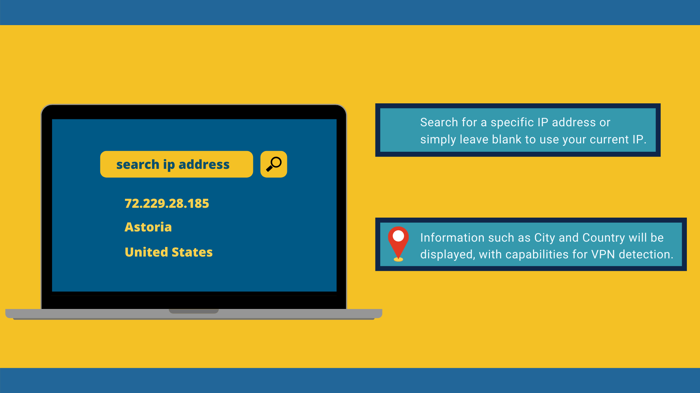

<h1 align=center>Minplatz : IP-based Geolocation</h1>

🌎📍 This program makes use of the <b>ipinfo API</b> to display information about either the users current location, or a specified IP. This information is returned as a <b>JSON file</b> 
and parsed before displaying the relavent results to a <b>Swing GUI</b>. This program also has the capability for VPN location through the API, however this is removed as there is an
additional cost for this service.
